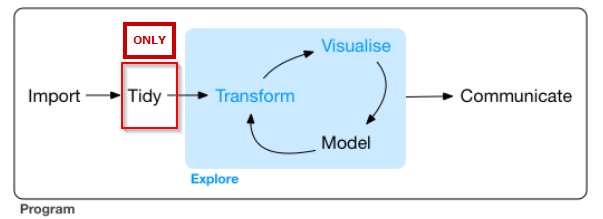
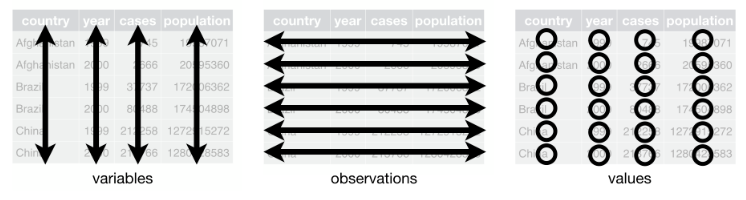
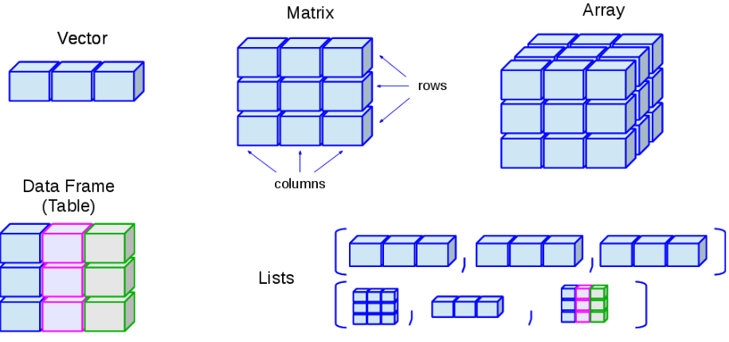
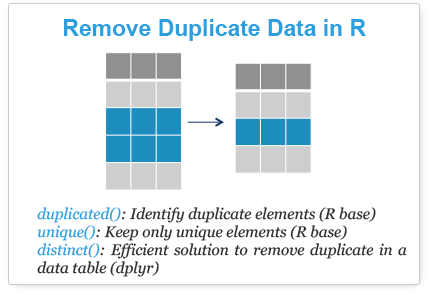

<Br>

**Note:**

-An R Notebook is an R Markdown document with chunks that can be executed independently and interactively, with output visible immediately beneath the input.

-Notebook output are available as HTML, PDF, Word, or Latex. 

-This Notebook as HTML is preferably open with Google Chrome.

-R-Code can be extracted as Rmd file under the button "Code" in the notebook.

-This Notebook using iterative development. It means the process starts with a simple implementation of a small set of idea requirements and iteratively enhances the evolving versions until the complete version is implemented and perfect.

<Br>

#Welcome

**Data Analyst-> Analysis of data**

>Analysis of data is a process of inspecting, cleaning, transforming, and modeling
data with the goal of highlighting useful information, suggesting conclusions, and
supporting decision making. (wikipedia.com)

**The 80/20 data science dilemma: **


>data scientists spend 80% of their time cleaning and manipulating data and only 20% of their time actually analyzing it." (forbes.com)

```{r}

#Link: https://www.forbes.com/sites/gilpress/2016/03/23/data-preparation-most-time-consuming-least-enjoyable-data-science-task-survey-says/#726c61386f63

```


**Data analytics lifecycle in R: **


```{r}

#Link: https://r4ds.had.co.nz/explore-intro.html

```


<Br>


#Messy vs Tidy data 

> "Happy families are all alike; every unhappy family is unhappy in its own way."-Leo Tolstoy

> "Tidy datasets are all alike, but every messy dataset is messy in its own way."-Hadley Wickham (Chief Data Scientist, Rstudio)

**Five Elements of Messy Data: **

* Column headers are values, not variable names.
* Multiple variables are stored in one column.
* Variables are stored in both rows and columns.
* Multiple types of observational units are stored in the same table.
* A single observational unit is stored in multiple tables.

See the [Tidy Data](http://vita.had.co.nz/papers/tidy-data.pdf) article for methods to fix messy data from [Journal of Statistical Software](https://www.jstatsoft.org/index).

**Three Elements of Tidy Data: **

* Each variable forms a column
* Each observation forms a row
* Each type of observational unit forms a table. 




```{r}

#Link: https://r4ds.had.co.nz/tidy-data.html

```


This Tidy Data principles follows the same principles as Codd's normalization (focus on a single dataset versus connected datasets like relational databases). More about [Codd's normalization process](https://dl.acm.org/citation.cfm?id=1734716)

**Note :**

For messy data is [OpenRefine (formerly Google Refine)](http://openrefine.org/) a powerful tool for working with.

<Br>

#Some R Background

##Data frame

**R objects: data frame **

In R a variables are not declared as some data type (numeric, integer, usw), but an objects. The data type of the R-object becomes the data type of the variable. A data frame is the most common way of storing data in R. It makes data analysis easier.

Following are the characteristics of a data frame.

* The column names should be non-empty.
* The row names should be unique.
* The data stored in a data frame can be of numeric, factor or character type.
* Each column should contain same number of data items.



```{r}

#Link: https://www.kaggle.com/timolee/a-home-for-pandas-and-sklearn-beginner-how-tos

```


Summary of data frame.

* Spreadsheet style data
* 2 dimensions 
* rows 
* columns 
* Can contain heterogenous data 
* All columns must be of equal length

**Useful Data Frame Functions: **

* `head()` - shows first 6 rows
* `tail()` - shows last 6 rows
* `dim()` - returns the dimensions of data frame (i.e. number of rows and number of columns)
* `nrow()` - number of rows
* `ncol()` - number of columns
* `str()` - structure of data frame - name, type and preview of data in each column
* `names()` - shows the names attribute for a data frame, which gives the column names.
* `sapply(dataframe, class)` - shows the class of each column in the data frame
* 

The structures of mtcars dataset.
* `str()`
* `class()`
* `attributes()`


**Data frame indexing/subsetting: **

Import a data frame dataset.


Creating a data frame.
```{r}

#Use the function data.frame() to construct a data frame. 
#Pass the vectors name, type, diameter, rotation and rings 
#as arguments to data.frame(), in this order.

# Definition of vectors
name <- c("Mercury", "Venus", "Earth", "Mars", "Jupiter", "Saturn", 
"Uranus",
 "Neptune")
type <- c("Terrestrial planet", "Terrestrial planet", 
"Terrestrial planet", 
          "Terrestrial planet", "Gas giant", "Gas giant", 
          "Gas giant", "Gas giant")
diameter <- c(0.382, 0.949, 1, 0.532, 11.209, 9.449, 4.007, 3.883)
rotation <- c(58.64, -243.02, 1, 1.03, 0.41, 0.43, -0.72, 0.67)
rings <- c(FALSE, FALSE, FALSE, FALSE, TRUE, TRUE, TRUE, TRUE)

# Create a data frame from the vectors
planets_df <-data.frame(name,type,diameter,rotation,rings)
planets_df

```


Investigate the structure of data frame.
```{r}

str(planets_df)
class(planets_df)
attributes(planets_df)

```

Selecting data frame elements.
```{r}

# Diameter of Mercury (row 1, column 3)
planets_df[1,3]

# Fata for Mars (entire fourth row)
planets_df[4,]

# Select first 5 values of diameter column
planets_df[1:5,"diameter"]

```

Only planets with rings.
```{r}

# Select the rings variable from planets_df
rings_vector <- planets_df$rings

# Print out rings_vector
rings_vector

# Adapt the code to select all columns for planets with rings
planets_df[rings_vector,]

```

Only planets with rings but shorter.
```{r}

# Select planets with rings
subset(planets_df,rings=="TRUE")


```


Sorting data frame.
```{r}

cevi<-c(10,100,9)
order(cevi)
cevi[order(cevi)]

positions <-  order(planets_df$diameter)
# Use positions to sort planets_df
planets_df[positions,]

```


Add column and rows in data frame.
```{r}

name<-c("cevi","herdian")
note<-c(1,2)

df_1<-data.frame(name, note)
df_1


name<-c("berlin","hamburg")
note<-c(3,4)

df_2<-data.frame(name, note)
df_2

df_3<-rbind(df_1,df_2)
df_3


df_3$address<-c("Indonesia","USA","Germany","Italy")

df_3
```


More transformation such as filter, select, arrange, mutate, summarise , and pipe operator please go to my [r-pedia](https://r-pedia.gitbook.io/cevi/intro-to-r-bootcamp/03-data-transformation)


##Special values

NA, NULL, ±Inf and NaN are special values in R. The meaning and differences between them are below.

* NA Stands for not available. NA is a placeholder for a missing value.
```{r}

NA + 1
sum(c(NA, 1, 2))
median(c(NA, 1, 2, 3), na.rm = TRUE)
length(c(NA, 2, 3, 4))
3 == NA
NA == NA
TRUE | NA

```

* NULL means no class (its class is NULL) and has length 0 so it does not take up any space in a vector.
```{r}

length(c(1, 2, NULL, 4))
sum(c(1, 2, NULL, 4))
x <- NULL
c(x, 2)

```

* Inf Stands for infinity (just for numeric).
```{r}

pi/0
2 * Inf
Inf - 1e+10
Inf + Inf
3 < -Inf
Inf == Inf

```

* NaN Stands for not a number (the result is unknown)
```{r}

NaN + 1
exp(NaN)

```

##Relational data

There are three types designed to work with relational data:

##Data transformation

<Br>

#Checklist for Data Cleaning

##1-Missing values

* A placeholder for a datum of which the type is known
but its value isn't. 
* It is impossible to perform statistical analysis


___Use case 1: Identify missing values___

1. Statistical analysis error
```{r}

age <- c(23, 16, NA)
mean(age)
## [1] NA
mean(age, na.rm = TRUE)
## [1] 19.5


```


2. Identify the NA value
```{r}

complete.cases(age)

#or

is.na(age)

```

3. Remove NA values (without NA values)
```{r}

na.omit(age)

```


___Use case 2: Recode missing values with mean___

1. Test for missing values NA
```{r}

x <- c(1:5, NA, 9:11, NA)
is.na(x)

df <- data.frame(col1 = c(1:3, NA),
                 col2 = c("this", NA,"is", "text"), 
                 col3 = c(TRUE, FALSE, TRUE, TRUE), 
                 col4 = c(2.5, 4.2, 3.2, NA),
                 stringsAsFactors = FALSE)
is.na(df)

```

To identify the location of the NA.
```{r}

which(is.na(x))
sum(is.na(df))

#or for data frame

colSums(is.na(df))

```

2. Recode missing values NA
Use normal subsetting and assignment operations.
```{r}

# recode missing values with the mean
# vector with missing data
x <- c(1:4, NA, 6:7, NA)
x
## [1]  1  2  3  4 NA  6  7 NA

x[is.na(x)] <- mean(x, na.rm = TRUE)

round(x, 2)
## [1] 1.00 2.00 3.00 4.00 3.83 6.00 7.00 3.83

# data frame that codes missing values as 99
df <- data.frame(col1 = c(1:3, 99), col2 = c(2.5, 4.2, 99, 3.2))

# change 99s to NAs
df[df == 99] <- NA
df
##   col1 col2
## 1    1  2.5
## 2    2  4.2
## 3    3   NA
## 4   NA  3.2

```

Recode missing values in a single data frame.

For example, here we recode the missing value in col4 with the mean value of col4.
```{r}

# data frame with missing data
df <- data.frame(col1 = c(1:3, NA),
                 col2 = c("this", NA,"is", "text"), 
                 col3 = c(TRUE, FALSE, TRUE, TRUE), 
                 col4 = c(2.5, 4.2, 3.2, NA),
                 stringsAsFactors = FALSE)
                 
df$col4[is.na(df$col4)] <- mean(df$col4, na.rm = TRUE)
df
##   col1 col2  col3 col4
## 1    1 this  TRUE  2.5
## 2    2 <NA> FALSE  4.2
## 3    3   is  TRUE  3.2
## 4   NA text  TRUE  3.3

```


3. Exclude missing values NA
```{r}

# A vector with missing values
x <- c(1:4, NA, 6:7, NA)

# including NA values will produce an NA output
mean(x)
## [1] NA

# excluding NA values will calculate the mathematical operation for all non-missing values
mean(x, na.rm = TRUE)
## [1] 3.833333

```

For complete observations.
```{r}

# data frame with missing values
df <- data.frame(col1 = c(1:3, NA),
                 col2 = c("this", NA,"is", "text"), 
                 col3 = c(TRUE, FALSE, TRUE, TRUE), 
                 col4 = c(2.5, 4.2, 3.2, NA),
                 stringsAsFactors = FALSE)

df
##   col1 col2  col3 col4
## 1    1 this  TRUE  2.5
## 2    2 <NA> FALSE  4.2
## 3    3   is  TRUE  3.2
## 4   NA text  TRUE   NA

complete.cases(df)
## [1]  TRUE FALSE  TRUE FALSE

# subset with complete.cases to get complete cases
df[complete.cases(df), ]
##   col1 col2 col3 col4
## 1    1 this TRUE  2.5
## 3    3   is TRUE  3.2

# or subset with `!` operator to get incomplete cases
df[!complete.cases(df), ]
##   col1 col2  col3 col4
## 2    2 <NA> FALSE  4.2
## 4   NA text  TRUE   NA

```

Alternativ with `omit.na()` function
```{r}


# or use na.omit() to get same as above
na.omit(df)
##   col1 col2 col3 col4
## 1    1 this TRUE  2.5
## 3    3   is TRUE  3.2

```

___Use case 3: Exploring missing values with naniar package___

**naniar** package provides principled, tidy ways to summarise, visualise, and manipulate missing data with minimal deviations from the workflows in ggplot2 and tidy data. 

[http://naniar.njtierney.com/index.html](http://naniar.njtierney.com/index.html)


___Use case 4: Missing Value Treatment___

**Data prep and pattern: **

Using BostonHousing dataset in `mlbench` package. The original BostonHousing data doesn't have missing values, but we injected this dataset with mising values.

```{r}
#install.packages("mlbench")
#library(mlbench)

# initialize the data
data ("BostonHousing", package="mlbench")
original <- BostonHousing  # backup original data

# Introduce missing values randomly
set.seed(100)
BostonHousing[sample(1:nrow(BostonHousing), 40), "rad"] <- NA #40 NA in "rad"
BostonHousing[sample(1:nrow(BostonHousing), 40), "ptratio"]<-NA #40 NA in "rad"
BostonHousing

```

The missing values have been injected. Identify the 'missings' pattern using ´mice::md.pattern`.
```{r}

# Pattern of missing values
#install.packages("mice")
#library(mice)
md.pattern(BostonHousing)  # pattern or missing values in data.

```

As we know there are 40 NA values in "rad" and also "ptratio".

**4 ways of dealing with missing values: **

1. Deleting the observations.

* Have sufficent data points, so the model doesn't lose power.
* Not to introduce bias (meaning, disproportionate or non-representation of classes).


Using `na.action=na.omit`
```{r}

# Example
lm(medv ~ ptratio + rad, data=BostonHousing, na.action=na.omit)

#Simple example:

cevi<-c(1,2,NA)
cevi

cevi_new<-na.omit(cevi)
cevi_new


```

2. Deleting the variable.

Delete the variable with missing values ("rad" and also "ptratio").


3. Imputation with mean / median / mode.

Replacing the missing values with the mean / median / mode is a crude way of treating missing values.
Depending on the context, like if the variation is low or if the variable has low leverage over the response, such a rough approximation is acceptable and could possibly give satisfactory results.


Change the missing values using `Hmisc` package.
```{r}
#install.packages("Hmisc")
#library(Hmisc)
impute(BostonHousing$ptratio, mean)  # replace with mean
impute(BostonHousing$rad, mean)  # replace with mean

#or

#impute(BostonHousing$ptratio, median)  # median
#impute(BostonHousing$ptratio, 20)  # replace specific number

```


Or impute manually.
```{r}

BostonHousing$ptratio[is.na(BostonHousing$ptratio)]<-mean(BostonHousing$ptratio, na.rm = TRUE)


```


Identify the accuracy when it is imputed with mean using `DMwR` package.
```{r}
#install.packages("DMwR")
#library(DMwR)
actuals <- original$ptratio[is.na(BostonHousing$ptratio)]
predicteds <- rep(mean(BostonHousing$ptratio, na.rm=T), length(actuals))
regr.eval(actuals, predicteds)


```

More info about this functions see

[https://www.rdocumentation.org/packages/DMwR/versions/0.4.1/topics/regr.eval](https://www.rdocumentation.org/packages/DMwR/versions/0.4.1/topics/regr.eval)


4. Prediction.

Prediction is most advanced method to impute your missing values and includes different approaches such as: kNN Imputation, rpart, and mice.

4.1 kNN Imputation

DMwR::knnImputation uses k-Nearest Neighbours approach to impute missing values.

```{r}
#install.packages("DMwR")
#library(DMwR)

knnOutput <- knnImputation(BostonHousing[, !names(BostonHousing) %in% "medv"])  # perform knn imputation.

anyNA(knnOutput)

```

Lets compute the accuracy.
```{r}

actuals <- original$ptratio[is.na(BostonHousing$ptratio)]
predicteds <- knnOutput[is.na(BostonHousing$ptratio), "ptratio"]
regr.eval(actuals, predicteds)

```

** Note: **
The mean absolute percentage error (mape) has improved by ~ 39% compared to the imputation by mean. Good


4.2 rpart

The limitation with `DMwR::knnImputation` is that it sometimes may not be appropriate to use when the missing value comes from a factor variable. Both rpart and mice has flexibility to handle that scenario. 

The idea here is we are going to use rpart to predict the missing values instead of kNN. To handle factor variable, we can set the method=class while calling `rpart()`. For numeric, we use, `method=anova`. Here again, we need to make sure not to train rpart on response variable (medv).

```{r}
#install.packages("rpart")
#library(rpart)
class_mod <- rpart(rad ~ . - medv, data=BostonHousing[!is.na(BostonHousing$rad), ], method="class", na.action=na.omit)  # since rad is a factor
anova_mod <- rpart(ptratio ~ . - medv, data=BostonHousing[!is.na(BostonHousing$ptratio), ], method="anova", na.action=na.omit)  # since ptratio is numeric.
rad_pred <- predict(class_mod, BostonHousing[is.na(BostonHousing$rad), ])
ptratio_pred <- predict(anova_mod, BostonHousing[is.na(BostonHousing$ptratio), ])


```

Lets compute the accuracy for ptratio.
```{r}

actuals <- original$ptratio[is.na(BostonHousing$ptratio)]
predicteds <- ptratio_pred
regr.eval(actuals, predicteds)


```

**Note: **The mean absolute percentage error (mape) has improved additionally by another ~ 30% compared to the knnImputation. Very Good.

Accuracy for rad.
```{r}

actuals <- original$rad[is.na(BostonHousing$rad)]
predicteds <- as.numeric(colnames(rad_pred)[apply(rad_pred, 1, which.max)])
mean(actuals != predicteds)  # compute misclass error.

```

**Note: **This yields a mis-classification error of 25%. Not bad for a factor variable!

4.3 mice

`mice` short for Multivariate Imputation by Chained Equations is an R package that provides advanced features for missing value treatment.

```{r}
#install.packages("mice")
#library(mice)
miceMod <- mice(BostonHousing[, !names(BostonHousing) %in% "medv"], method="rf")  # perform mice imputation, based on random forests.
miceOutput <- complete(miceMod)  # generate the completed data.
anyNA(miceOutput)


```

Lets compute the accuracy of ptratio.
```{r}

actuals <- original$ptratio[is.na(BostonHousing$ptratio)]
predicteds <- miceOutput[is.na(BostonHousing$ptratio), "ptratio"]
regr.eval(actuals, predicteds)

```

The mean absolute percentage error (mape) has improved additionally by ~ 48% compared to the rpart. Excellent!.

Lets compute the accuracy of rad.
```{r}

actuals <- original$rad[is.na(BostonHousing$rad)]
predicteds <- miceOutput[is.na(BostonHousing$rad), "rad"]
mean(actuals != predicteds)  # compute misclass error.

```

The mis-classification error reduced to 15%, which is 6 out of 40 observations. This is a good improvement compared to rpart's 25%.

More info: 

* [Imputing Missing Data with R; MICE package](https://datascienceplus.com/imputing-missing-data-with-r-mice-package/)

* [Handling missing data with MICE package; a simple approach](https://datascienceplus.com/handling-missing-data-with-mice-package-a-simple-approach/)

This `mice` approach based on [Multivariate Imputation by Chained Equations in R journal][https://www.jstatsoft.org/article/view/v045i03]

> **Note: ** Though we have an idea of how each method performs, there is not enough evidence to conclude which method is better or worse. But these are definitely worth testing out the next time you impute missing values.


##2-Special  values

Special values are a values that are not an element of the
mathematical set of real numbers (???) (example: ±Inf and NaN). 


**A function to check special values in a data.frame: **
```{r}
age<-c(21,42,33,18,21,NA,Inf,NaN)
height<-c(111,112,113,114,115,116,117,118)
person<-data.frame(age,height)

is.finite(c(1, Inf, NaN, NA))

is.special <- function(x){
if (is.numeric(x)) !is.finite(x) else is.na(x)
}

sapply(person, is.special)

person[sapply(person, is.special),]
```


##3-Duplicate  values

*  R base functions:
  
    * `duplicated()`: for identifying duplicated elements and
    * `unique()`: for extracting unique elements

* `distinct()` function from **dplyr** package to remove duplicate rows in a data frame.



```{r}
#Link: https://www.datanovia.com/en/lessons/identify-and-remove-duplicate-data-in-r/

```

**Package.**
```{r}
install.packages("tidyverse")
library(tidyverse)

```

**Dataset.**
```{r}

my_data <- as_tibble(iris) #ribble aren`t different from dataframe, just a litte different aspekt.
my_data


```


**Find and drop duplicate elements.**
```{r}

x <- c(1, 1, 4, 5, 4, 6)
duplicated(x)

#Extract duplicate elements:
x[duplicated(x)]

#Remove duplicated elements:
x[!duplicated(x)]

```

**Remove duplicate rows from a data frame.**
```{r}

# Remove duplicates based on Sepal.Width columns
my_data[!duplicated(my_data$Sepal.Width), ]

```

**Extract unique elements.**
```{r}

x <- c(1, 1, 4, 5, 4, 6)
unique(x)

#apply unique() on a data frame:
unique(my_data)

```


**Remove duplicate rows in a data frame.**
```{r}

my_data %>% distinct()

```

**Remove duplicate rows based on certain columns (variables).**
```{r}

# Remove duplicated rows based on Sepal.Length
my_data %>% distinct(Sepal.Length, .keep_all = TRUE)

# Remove duplicated rows based on 
# Sepal.Length and Petal.Width
my_data %>% distinct(Sepal.Length, Petal.Width, .keep_all = TRUE)

#The option .kep_all is used to keep all variables in the data.
```


**Summary: **

* Remove duplicate rows based on one or more column values: my_data %>% dplyr::distinct(Sepal.Length)
* R based function:  `unique(my_data)`
* Identify duplicate values: `duplicated(my_data)`


##4-Outliers

<Br>

#Change log update

* 28.12.2018
* 30.12.2018

<Br>

#Preferences

* [R for Data Science](https://r4ds.had.co.nz/)
* [KDnuggets](https://www.kdnuggets.com/)
* [George A. Smathers Libraries](https://guides.uflib.ufl.edu/precisionpublichealth/tidy_messy)
* [Journal of Statistical Software](https://www.jstatsoft.org/index)
* [An introduction to data cleaning with R](https://cran.r-project.org/doc/contrib/de_Jonge+van_der_Loo-Introduction_to_data_cleaning_with_R.pdf)
* [Tutorialspoint](https://www.tutorialspoint.com/r/index.htm)
* [DataCamp](https://www.datacamp.com/)
* [Software carpentry](https://software-carpentry.org/lessons/index.html)
* [UC Business Analytics R Programming Guide ](http://uc-r.github.io/)
* [Datanovia](https://www.datanovia.com/en/lessons/identify-and-remove-duplicate-data-in-r/)
* [R-bloggers](https://www.r-bloggers.com/)
* [R-statistics.co](http://r-statistics.co/)
* [Datascience+](https://datascienceplus.com/)


#License

[MIT](https://opensource.org/licenses/MIT)

